# Veebiliidese haldamine

## Sisukord

- [Veebiliidese haldamine](#veebiliidese-haldamine)
  - [Sisukord](#sisukord)
  - [Realmi loomine - näiteks kooli jaoks TLU-HK](#realmi-loomine---näiteks-kooli-jaoks-tlu-hk)
  - [Kasutaja loomine](#kasutaja-loomine)
  - [Rollide lisamine](#rollide-lisamine)
  - [Rollile õiguste lisamine](#rollile-õiguste-lisamine)
  - [Gruppide loomine](#gruppide-loomine)
  - [Kliendi loomine](#kliendi-loomine)
  - [Andmete import/export](#andmete-importexport)
- [Rakendusliidesega haldamine](#rakendusliidesega-haldamine)
  - [Serveri staatus](#serveri-staatus)
  - [Autentimine](#autentimine)
    - [Kasutaja autentimiseks (Form-encode):](#kasutaja-autentimiseks-form-encode)
    - [Kliendi autentimiseks (Form-encode):](#kliendi-autentimiseks-form-encode)
  - [Lõppsõlmede päringud](#lõppsõlmede-päringud)

Enne kui Keycloaki veebiliideses mida teha saab, on vajalik see üles seadistada vastavalt kasutaja vajadustele. Praeguses juhendis keskendume kuidas kooli jaoks uut Realmi luua ning talle kasutajaid rollidega. Samuti loome ka Clienti, kes on kui infosüsteem, kes pärib Keycloakist kasutajate andmeid üle REST rakendusliidese.
Realmide loomine käib ainult administraatori õigustega kasutajal ning selle loomiseks peame me sisse logima veebiliideses, mis on kätte saadav kooli sisevõrgu aadressilt: `http://keycloak.kolledz`.

Sisselogimise aken, kuhu läheb administraatori tunnused:
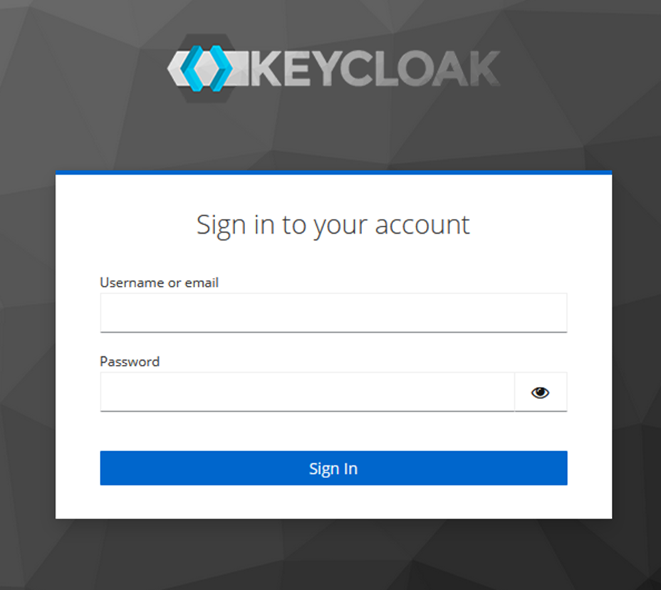

Sisselogimisel administraatori tunnustega avatakse pealeht:
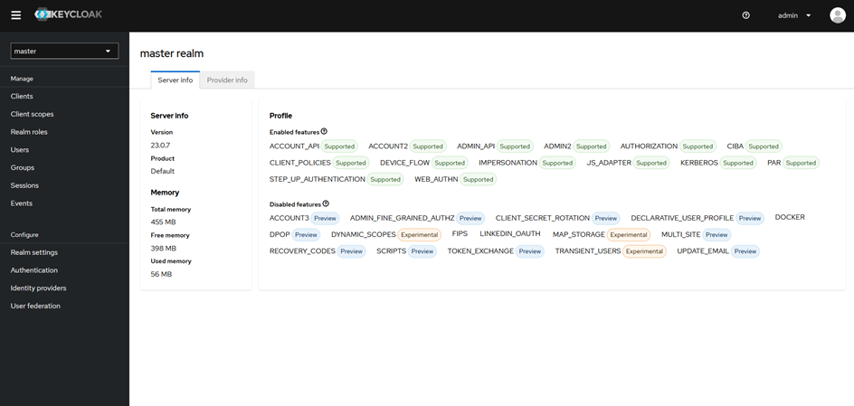

## Realmi loomine - näiteks kooli jaoks TLU-HK

Vaikeväärtusena on „master“ Realm olemas ning seda soovitatakse kasutada ainult uute Realmide loomisel või süsteemi administreerimisel. Samuti avatakse see ka vaikelehena iga kord kui administraatori kontoga sisse logitakse

Loome uue Realmi kooli jaoks vajutades rippmenüü peale ja sealt klikkides nupule „Create realm“:
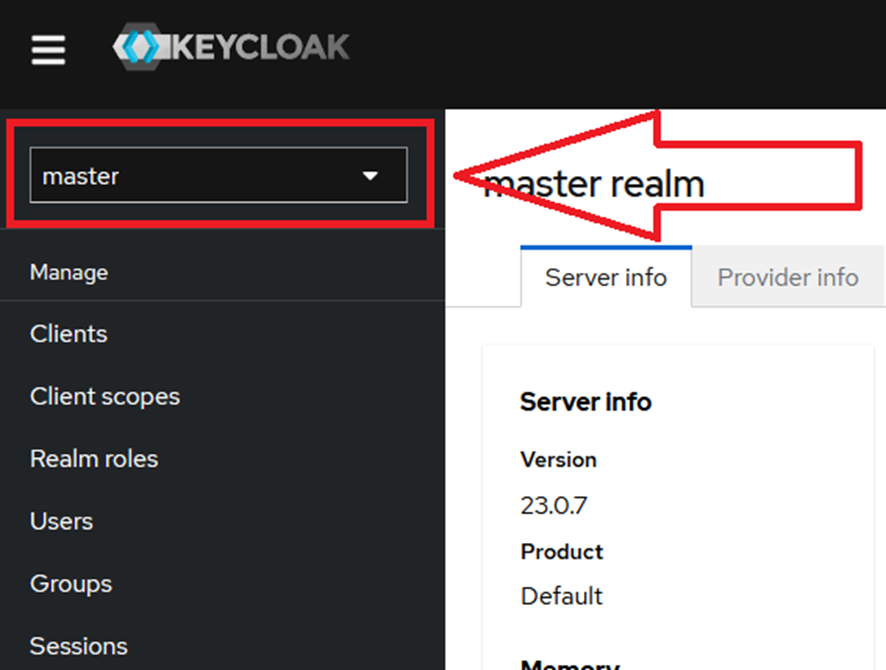

Anname uuele Realmile nimeks „TLU-HK“. Soovitatav on kasutada sidekriipsu või muud sümbolit eraldajana tühiku asemel, et üle rakendusliidese oleks kergem andmeid lõppsõlmedest küsida. Peale „Create“ nupule vajutamist suunatakse meid äsja loodud Realmi pealehele:
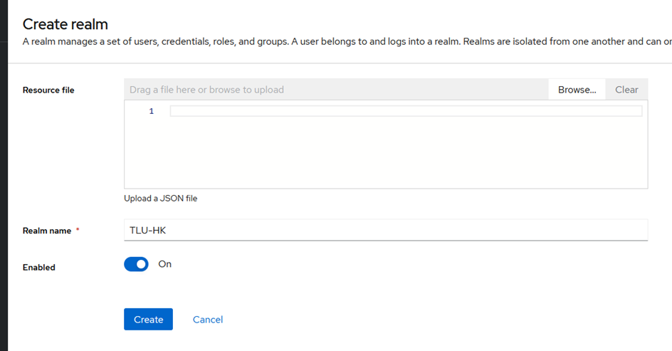

## Kasutaja loomine

Uue kasutaja lisamine käib vasakult kuvatavast menüüst „Users“ valikust:
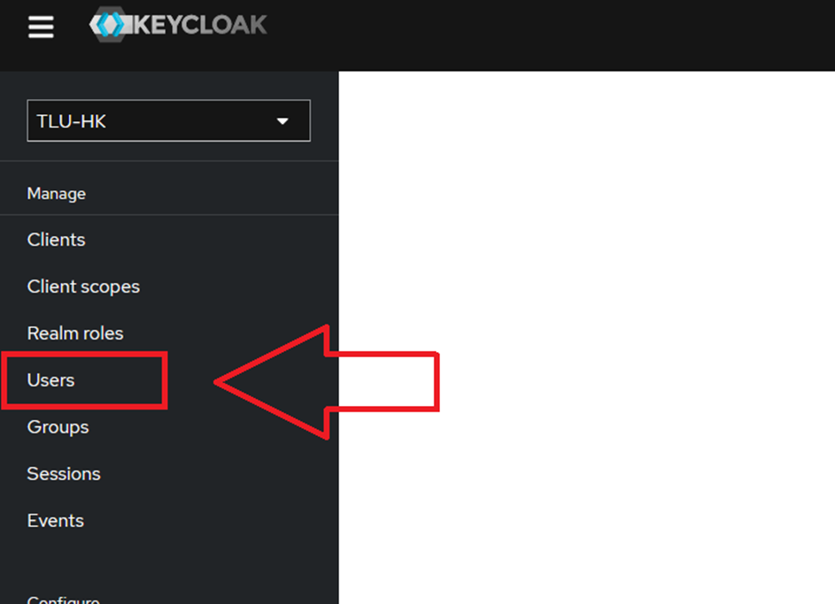

Kasutaja loomise vorm kuvatakse peale „Add user“ nupule vajutamist:
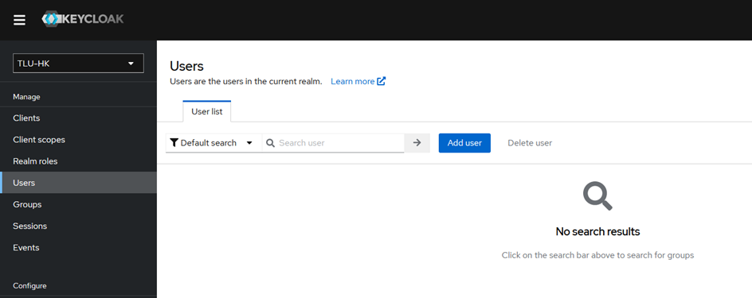

Uues avanenud vaates saame ära defineerida kasutajale olulised parameetrid: kasutajatunnuse, mida kasutatakse ühtlasi ka sisse logimisel, tema e-maili, eesnime ja perenime. Mugavuse mõttes saame lisada kohe ka grupid külge näiteks õppekavad, õppeained või rühmad:
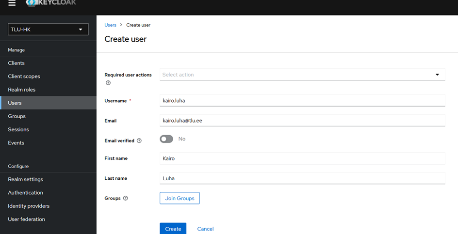

Kui kasutaja on loodud, saame talle anda juurde ka lisaparameetrid menüüvalikust „Attributes“:
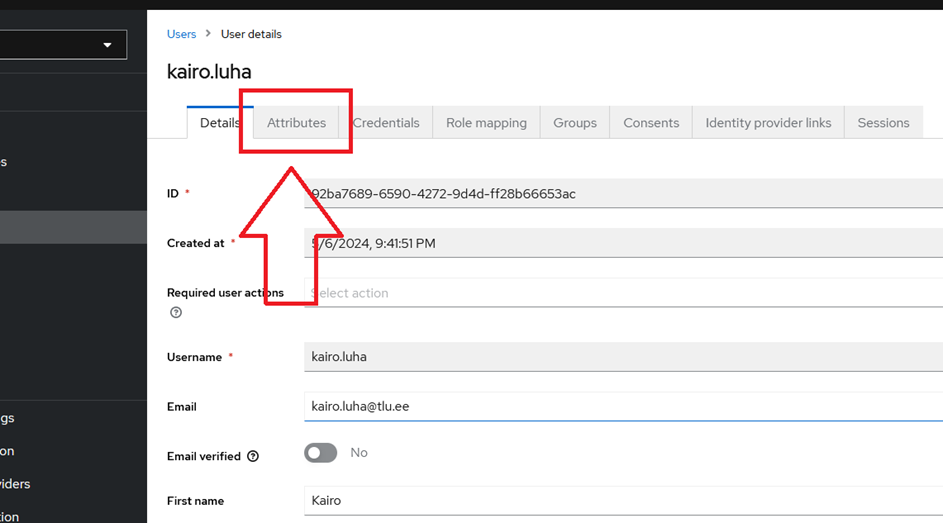

Kasutajale lisaväljade lisamiseks on vajalik vajutada „Add an attribute“ nupule, kus saame ära defineerida järgnevad parameetrid: Githubi kasutajatunnuse(GH_username), Githubi organisatsiooni nime, kuhu kasutaja kuulub(GH_personal_org), Discordi kasutajatunnuse (discord_username), Githubi isikliku repositooriumi nime (GH_personal_repo), Discordi kasutaja ID (discord_id), TLÜ kasutajatunnuse (TLU_username) ja isikukoodi. Peale andmete sisestamist tuleb salvestamiseks „Save“ nupule klõpsata:
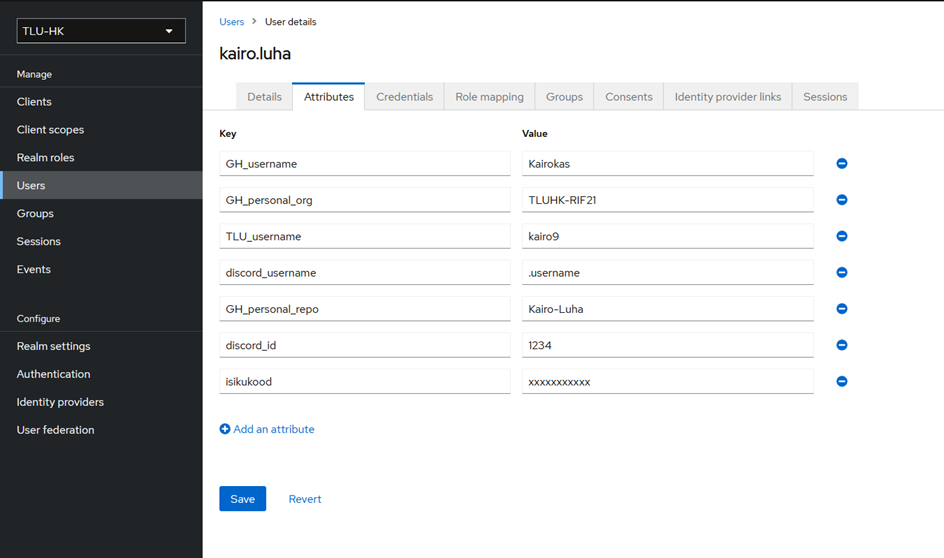

Uue kasutaja loomisel vaikeväärtusena tal parooli pole, seega oleks mõistlik seegi talle seadistada „Credentials“ menüüst. Ajutise parooli puhul tuleks silmas pidada, et „Temporary“ valik jääks sisse, mis tähendab, et kasutaja peab järgmisel sisenemisel parooli ära vahetama. Kui sätted paigas, siis vajutame „Save“:
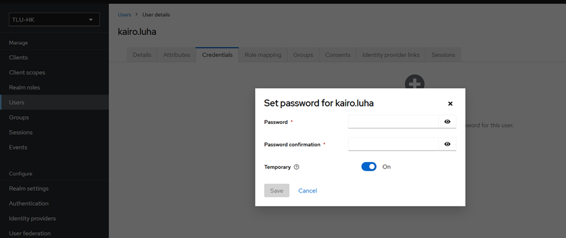

„Reset password“ nupule vajutades avaneb meile aga sama aken mis parooli loomisel, mille abil saame ühtlasi ka kasutaja parooli vahetada. Vajadusel saab parooli ka ära kustutada:
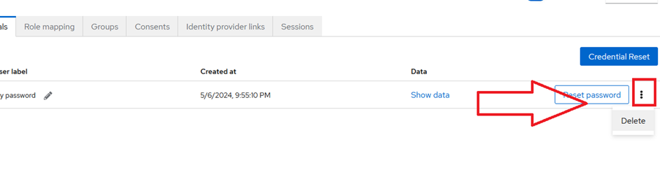

## Rollide lisamine

Järgmisena defineerime ära TLU-HK Realmis rollid ning vajadusel saab igale rollile eraldi ka defineerida õigused. Rollide lisamiseks vali vasakult menüüst „Realm roles“:
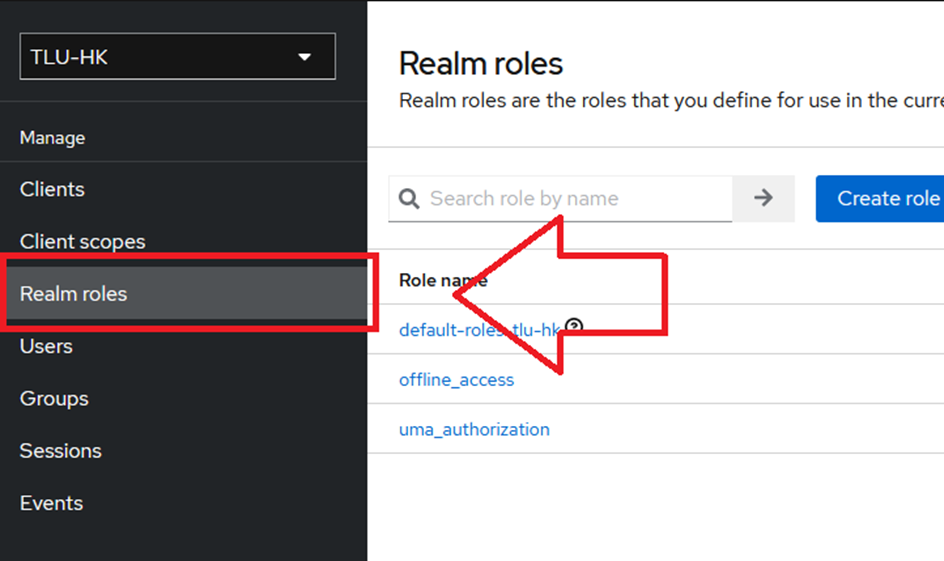

Esmalt loome tudengi rolli vajutades „Create role nupule“:
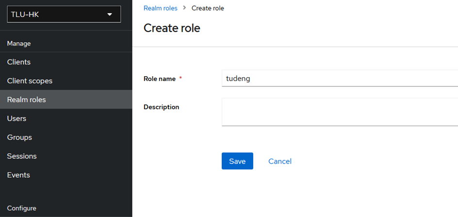

Kui „Save“ on vajutatud, siis avatakse sama vaade uuesti kuid uus roll on loodud ning tekib võimalus tallegi lisaväljad defineerida:
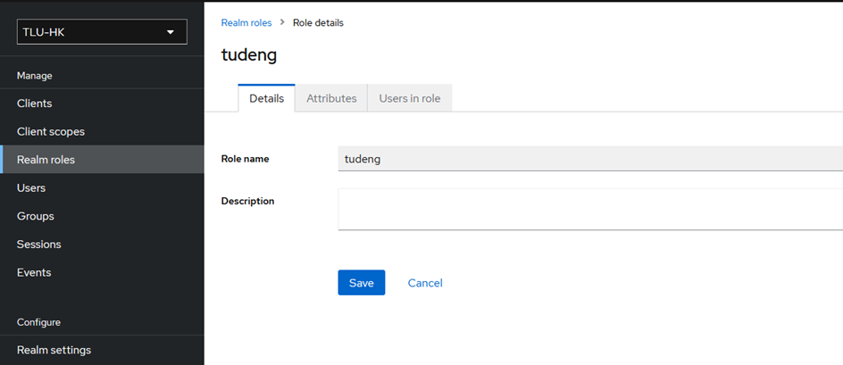

Kasutajale rollide lisamine on võimalik aga kahest kohast: rolli avades klikates „Users in role“ menüüvaliku peale või siis „Users“ -> „Role Mapping“ alt:
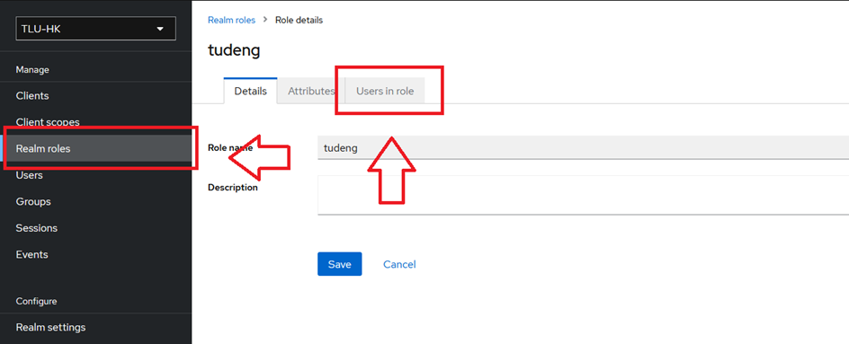
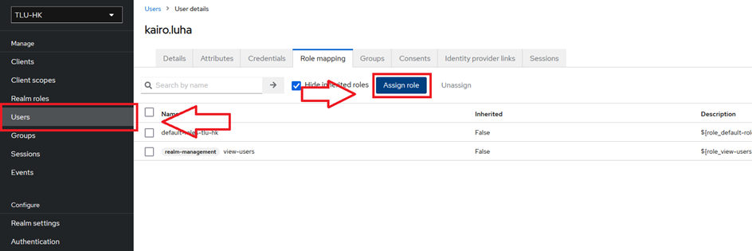

Sarnaselt tudengi rolli loomisele lisame ka rolli „lektor“.

## Rollile õiguste lisamine

Nüüd on meil võimalus lisada rollile ka õigusi, mida ta teha saab või näha andmete pärimisel läbi rakendusliidese(ühe õiguse puudumisel tagastatakse lihtsalt HTTP vastus 200 sisuga: []). Õiguste lisamine käib aga menüüst natuke eemalt paremalt vajutades „Action“ rippmenüü nupule ning sealt edasi liikudes „Add associated roles“ peale ning filtrist valides „Filter by clients“ (klientidele ehk infosüsteemidele, mis kasutavad Keycloaki antakse õiguseid samamoodi). Anname kasutajale ka rolliks „realm-management view-users“, et kasutaja saaks üle rakendusliidese pärida ja näha kõiki kasutajaid:
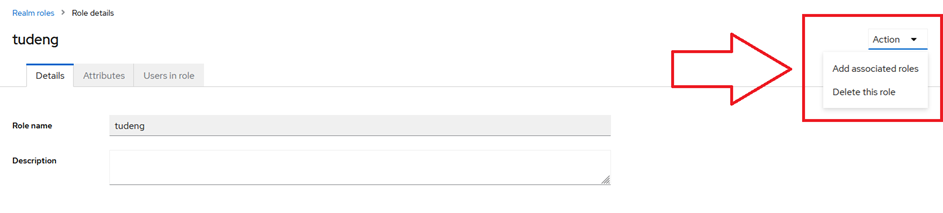
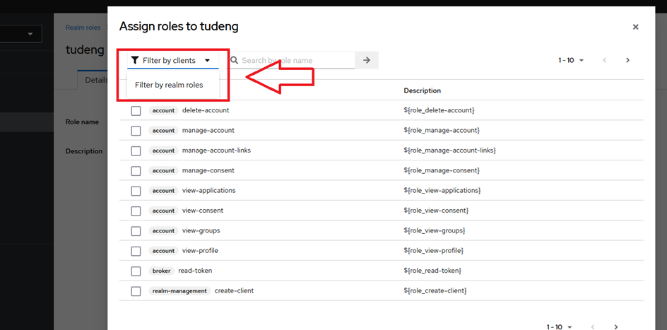

## Gruppide loomine

Gruppide loomine käib aga eraldi „Groups“ sektsioonist, kus lisame õppekava ja õppeaine grupid vastavalt „RIF21“ ning „Uurimistöö-II“ vajutades seal „Create group“ nupule:
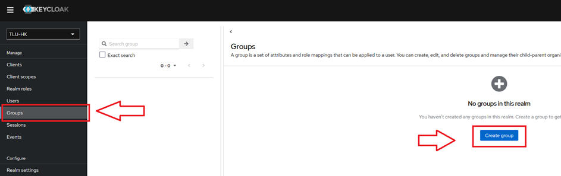

Kui grupid on loodud, avaneb meil järgmine vaade:
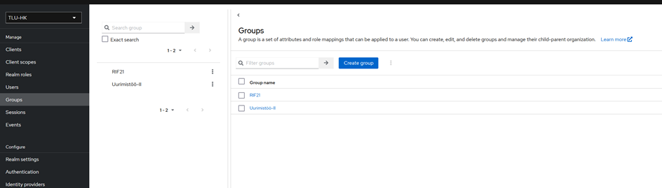

Grupi nimele peale klikates avaneb aga uus vaade, kus saab defineerida grupile alamgrupid, liikmed, lisaväljad ning rollid. „Attributes“ alt on leitavad lisaväljad, kus defineerime vastavalt õppeaine/õppekavale lisaväljad. Õppeainele lisame väljad: kirjeldus (description), kood (code), EAP, hindamisvorm (eval), semester ja õppematerjalide asukoha Githubi repositooriumi näol (GH_repo_url):
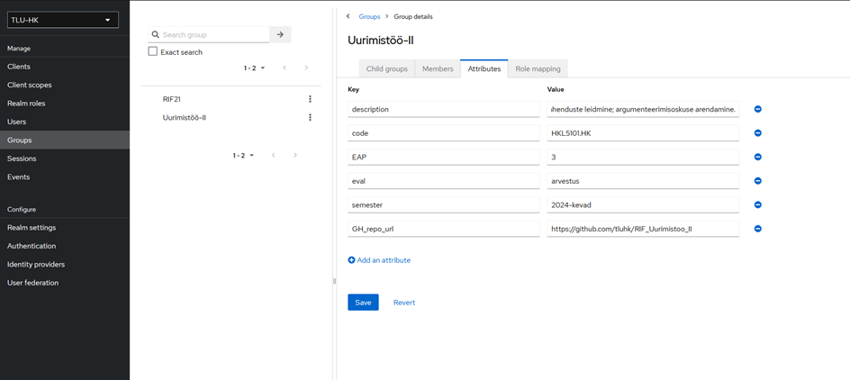

Kasutajate lisamine gruppi käib aga „Members“ sektsioonist, kus samamoodi lisame kasutaja ka õppeaine gruppi Uurimistöö-II:
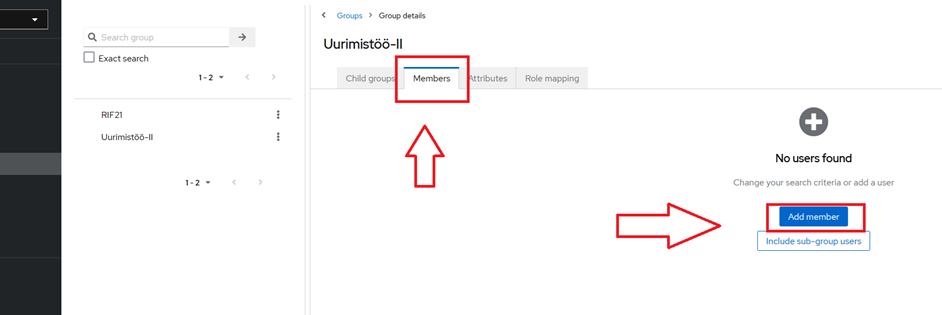

## Kliendi loomine

Järgmisena loome aga esimese kliendi, mis on infosüsteem, kes saab päringuid teha vastu Keycloaki rakendusliidest koos kasutaja autentimisega(või ilma) ning on leitav „Clients“ menüüvalikust:
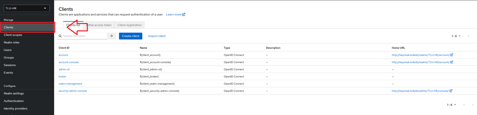

Klientide loomiseks üle rakendusliidese on kasutusel „Initial Access token“, mille saab samuti siit luua. Uue infosüsteemi kasutusele võtmisel loome aga uue kliendi „Create client“ nupuga. Client ID alla läheb unikaalne kliendi tunnus näiteks „gh_tooriist“:
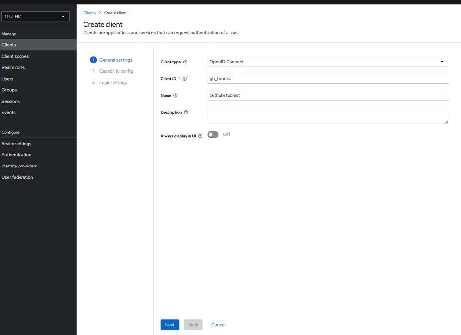

„Next“ peale vajutades liigume edasi autentimissektsiooni, kus ütleme ette, et „Client authentication“ on lubatud, mis tähendab, et vajalik on sisse logida kasutajatunnusega samuti enne kui päringuid tegema hakatase vastu rakendusliidest. „Authorizationi“ lülitame samuti sisse kuna meil on vajalik defineerida ära kes kui palju näeb:
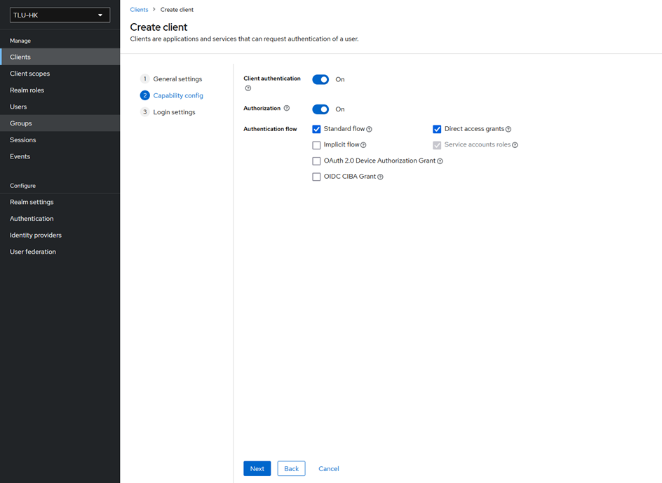

Järgmises sammus „Login settings“ midagi ei defineeri kuid vajadusel saab tugineda Keycloaki ametlikule dokumentatsioonile. Kui sätted on paigas, siis peab vajutama nupule „Save“:
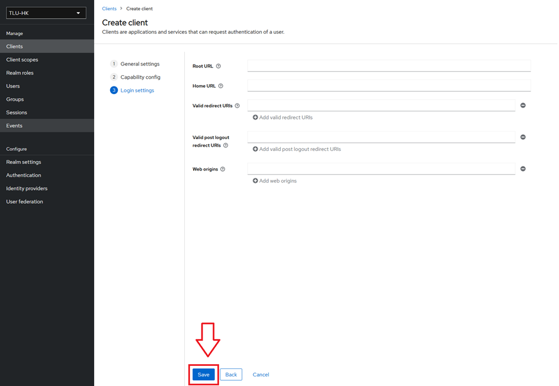

Kui uue kliendi lisamine õnnestus, suunatakse meid selle sätete lehele, kust leiame salajase võtme „Credentials“ sektsioonist „Client Secret“ väljalt, mida peame esmasel autentimisel vastu rakendusliidest kaasa andma, mille katame järgnevas peatükis:
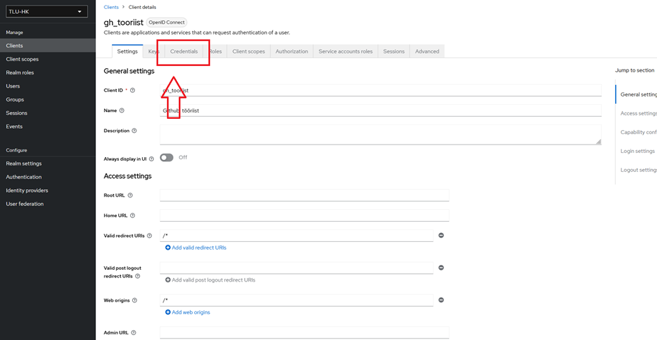
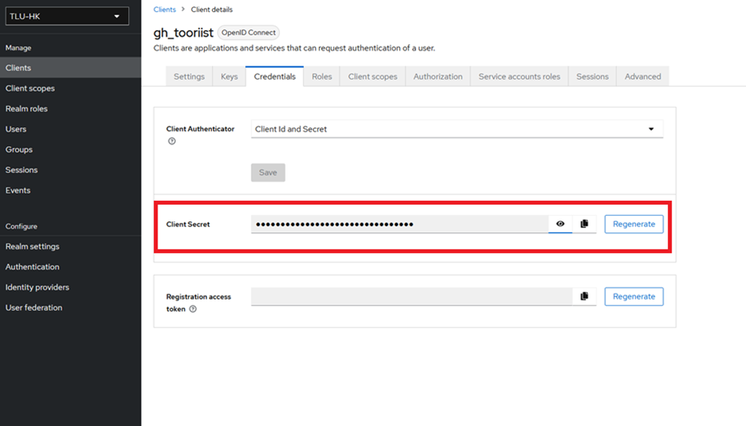

Kui aga klient peab saama pärida teatud andmeid üle rakendusliidese, on meil vaja talle ka õigused selleks anda „Service accounts roles" vahelehelt vajutades „Assign role“ peale ning edasi filtrite seast valides „Filter by clients“ sarnaselt kasutajatele õiguste andmisel, mis sai ülevalpool kaetud peale kasutaja loomist, et klient saaks pärida rakendusliidesest teatud ressursse.

## Andmete import/export

Keycloakis olevate andmete import/export käib aga kahte moodi: läbi veebiliidese ning otse käsurealt või antud juhul läbi docker-compose.yml faili. Läbi veebiliidese exportimisel ei ole aga kasutajaid kaasas. Andmete exportimisel väljastatakse fail, mis on JSONi kujul ning seda saab vajadusel ka uude Keycloaki importida. Veebiliidesest Keycloaki andmete exportimine käib „Realm settings“ menüüst vajutades „Action“ rippmenüü nupule:
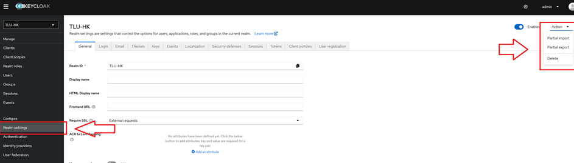

# Rakendusliidesega haldamine

Ametlik dokumentatsioon rakendusliidese lõppsõlmede osas:
`https://www.keycloak.org/docs-api/22.0.1/rest-api/index.html`

Ametlik dokumentatsioon rakendusliidese autoriseerimise osas:
`https://www.keycloak.org/docs/latest/authorization_services/index.html#_overview`

## Serveri staatus

Enne kui hakkame päringuid vastu Keycloaki tegema, on mõistlik testida, kas rakendusliides meile vastab.
GET: `http://keycloak.kolledz/health/ready`

Vastus:

```json
{
  "status": "UP",
  "checks": []
}
```

## Autentimine

Autentimisel on suuresti abiks lõppsõlm, kus on defineeritud ära erinevad sätted sellega seonduvalt:
GET: `http://keycloak.kolledz/realms/TLU-HK/.well-known/openid-configuration`

Kui rakendusliides on valmis päringuid vastu võtma, siis on vajalik enne andmete saamist kliendil autentida end.
POST: `http://keycloak.kolledz/realms/TLU-HK/.well-known/openid-configuration`
Pane tähele, et Headers peab sisaldama välja ja väärtust: `Content-Type: application/x-www-form-urlencoded`

### Kasutaja autentimiseks (Form-encode):

`grant_type=password&username=username&password=password&client_id=gh_tooriist&client_secret=FROM_WEB_UI`

### Kliendi autentimiseks (Form-encode):

`grant_type=client_credentials&client_id=gh_tooriist&client_secret=FROM_WEB_UI`

Vastus:

```json
{
  "access_token": "ey...",
  "expires_in": 300,
  "refresh_expires_in": 0,
  "token_type": "Bearer",
  "not-before-policy": 0,
  "scope": "profile email"
}
```

## Lõppsõlmede päringud

Iga järgnev päring tahab kaasa autentimisel saadud JWT (autentimise vastuse "access_token" väärtus) `Authorization: Bearer ey...` kaasa.
Kui autentimine tehti ainult kliendi põhiselt, siis piisab ainult veebiliideses antud rollidest.
Kui autentimine tehti aga kasutajaga samaaegselt (grant_type=password), siis on vaja rollid määrata nii kliendile kui ka kasutajale.

Kõikide kasutajate pärimiseks on kasutusel lõppsõlm:
GET: `http://keycloak.kolledz/admin/realms/TLU-HK/users`

Vastus:

```json
[
  {
    "id": "92ba7689-6590-4272-9d4d-ff28b66653ac",
    "createdTimestamp": 1715020911318,
    "username": "kairo.luha",
    "enabled": true,
    "totp": false,
    "emailVerified": true,
    "firstName": "Kairo",
    "lastName": "Luha",
    "email": "kairo.luha@tlu.ee",
    "attributes": {
      "GH_username": [
        "Kairokas"
      ],
      "GH_personal_org": [
        "TLUHK-RIF21"
      ],
      "TLU_username": [
        "kairo9"
      ],
      "discord_username": [
        ".username"
      ],
      "GH_personal_repo": [
        "Kairo-Luha"
      ],
      "discord_id": [
        "1234"
      ]
    },
    "disableableCredentialTypes": [],
    "requiredActions": [],
    "notBefore": 1715102527,
    "access": {
      "manageGroupMembership": false,
      "view": true,
      "mapRoles": false,
      "impersonate": false,
      "manage": false
    }
  },
  ...
]
```

---------------

Kasutaja kustutamise lõppsõlm:
DELETE: `http://keycloak.kolledz/admin/realms/TLU-HK/users/{id}`

Vastus: `HTTP_status/204 No Content`

---------------

Kasutaja lisamise lõppsõlm:
POST: `http://keycloak.kolledz/admin/realms/TLU-HK/users`

Body:

```json
{
  "username": "kalle.kaalikas",
  "emailVerified": true,
  "firstName": "Kalle",
  "lastName": "Kaalikas",
  "email": "kalle.kaalikas@tlu.ee",
  "enabled": true,
  "groups": ["RIF21"],
  "attributes": {
    "discord_id": "xxxx"
  }
}
```

Vastus: `HTTP_status/201 Created`

---------------

Kasutaja parooli muutmise lõppsõlm:
PUT: `http://keycloak.kolledz/admin/realms/TLU-HK/users/{id}/reset-password`

Body:

```json
{
  "temporary": false,
  "value": "NEW_PASSWORD"
}
```

Vastus: `HTTP_status/204 No Content`

---------------

Uue rolli loomine:
POST: `http://keycloak.kolledz/admin/realms/TLU-HK/roles`
Body:

```json
{
  "name": "ROLE_NAME"
}
```

Vastus: `HTTP_status/201 Created`

---------------

Kasutajale uue rolli lisamine:
PUT: `http://keycloak.kolledz/admin/realms/TLU-HK/users/{id}/groups/{groupId}`

Vastus: `HTTP_status/204 No Content`

---------------

Uue grupi loomine:
POST: `http://keycloak.kolledz/admin/realms/TLU-HK/roles`

Body:

```json
{
  "name": "GROUP_NAME"
}
```

Vastus: `HTTP_status/201 Created`

---------------

Kasutaja lisamine gruppi:
PUT: `http://keycloak.kolledz/admin/realms/TLU-HK/users/{id}/groups/{groupId}`

Vastus: `HTTP_status/204 No Content`

---------------

Kõikide gruppide pärimine:
GET: `http://keycloak.kolledz/admin/realms/TLU-HK/groups`

Vastus:

```json
[
  {
    "id": "ce08c75b-4b68-4b38-8cbf-1e701fc24a62",
    "name": "RIF21",
    "path": "/RIF21",
    "subGroupCount": 0,
    "subGroups": [],
    "access": {
      "view": true,
      "viewMembers": true,
      "manageMembers": true,
      "manage": true,
      "manageMembership": true
    }
  },
  ...
]
```

---------------

Grupi liikmete pärimine:
GET: `http://keycloak.kolledz/admin/realms/TLU-HK/groups/{groupId}/members`

Vastus:

```json
[
  {
    "id": "92ba7689-6590-4272-9d4d-ff28b66653ac",
    "createdTimestamp": 1715020911318,
    "username": "kairo.luha",
    "enabled": true,
    "totp": false,
    "emailVerified": true,
    "firstName": "Kairo",
    "lastName": "Luha",
    "email": "kairo.luha@tlu.ee",
    "attributes": {
      "GH_username": [
        "Kairokas"
      ],
      "GH_personal_org": [
        "TLUHK-RIF21"
      ],
      "TLU_username": [
        "kairo9"
      ],
      "discord_username": [
        ".username"
      ],
      "GH_personal_repo": [
        "Kairo-Luha"
      ],
      "discord_id": [
        "1234"
      ]
    },
    "disableableCredentialTypes": [],
    "requiredActions": [],
    "notBefore": 1715102527
  },
  ...
]
```

---------------

Teatud rolli omavate kasutajate pärimine:
GET: `http://keycloak.kolledz/admin/realms/TLU-HK/roles/tudeng/users`

Vastus:

```json
[
  {
    "id": "92ba7689-6590-4272-9d4d-ff28b66653ac",
    "createdTimestamp": 1715020911318,
    "username": "kairo.luha",
    "enabled": true,
    "totp": false,
    "emailVerified": true,
    "firstName": "Kairo",
    "lastName": "Luha",
    "email": "kairo.luha@tlu.ee",
    "attributes": {
      "GH_username": [
        "Kairokas"
      ],
      "GH_personal_org": [
        "TLUHK-RIF21"
      ],
      "TLU_username": [
        "kairo9"
      ],
      "discord_username": [
        ".username"
      ],
      "GH_personal_repo": [
        "Kairo-Luha"
      ],
      "discord_id": [
        "1234"
      ]
    },
    "disableableCredentialTypes": [],
    "requiredActions": [],
    "notBefore": 1715102527
  },
  ...
]
```

---------------

Teatud kasutaja kõikide rollide pärimine:
GET: `http://keycloak.kolledz/admin/realms/TLU-HK/users/{id}/role-mappings`

Vastus:

```json
{
  "realmMappings": [
    {
      "id": "3fbcc7c7-81a3-4271-9783-526f6f0b9d0f",
      "name": "tudeng",
      "description": "",
      "composite": false,
      "clientRole": false,
      "containerId": "b6dccce0-b86c-4b50-92ac-fb911388907e"
    }
    ...
  ],
  "clientMappings": {
    "realm-management": {
      "id": "cb3d42f3-973f-4847-8c3a-b77341c25cac",
      "client": "realm-management",
      "mappings": [
        {
          "id": "caffdc7f-1cbf-47dc-9c3d-42a0e81ba304",
          "name": "view-users",
          "description": "${role_view-users}",
          "composite": true,
          "clientRole": true,
          "containerId": "cb3d42f3-973f-4847-8c3a-b77341c25cac"
        }
      ]
    }
  }
}
```

---------------

Teatud kasutaja gruppidesse kuuluvuse pärimine:
GET: `http://keycloak.kolledz/admin/realms/TLU-HK/users/{id}/groups`

Vastus:

```json
[
  {
    "id": "ce08c75b-4b68-4b38-8cbf-1e701fc24a62",
    "name": "RIF21",
    "path": "/RIF21",
    "subGroups": []
  },
  ...
]
```

---------------
